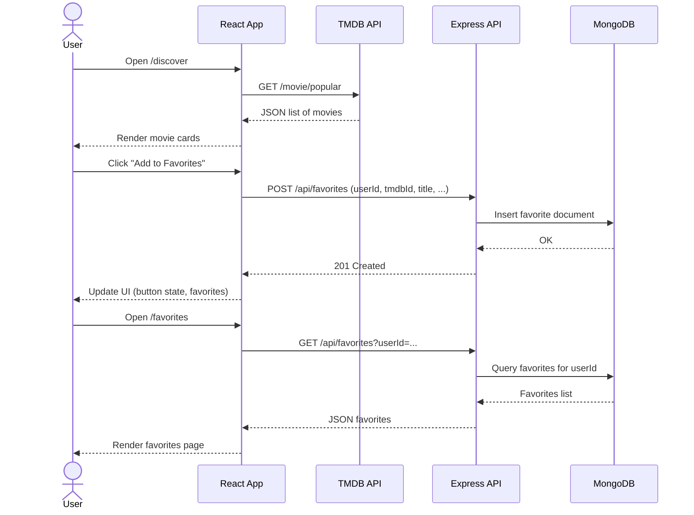

# Capstone Movie App

A full-stack **movie discovery** web application built with **React + Vite**, **Express**, and **MongoDB**, deployed fully to the cloud.

This project is my capstone for the Software Engineering course. It demonstrates:

- React frontend with routing, Context + `useReducer`, and data-fetching
- Google OAuth login
- Integration with **The Movie Database (TMDB)** external API
- Express backend with full **CRUD** for playlists and reviews, plus favorites
- MongoDB persistence with Mongoose
- Cloud deployment for both frontend and backend
- Dev Container for reproducible development
- Automated end-to-end tests using **Playwright**
- Design artifact (sequence diagram)
- Short video walkthrough (to be added)

---

## 1. Live Links

- **Frontend (React / Vite / Netlify)**  
  👉 https://capstone-movie-app.netlify.app

- **Backend (Express / Render)**  
  👉 https://capstone-movie-backend.onrender.com

- **Backend health check**  
  👉 https://capstone-movie-backend.onrender.com/api/health

- **Video demonstration (3–5 minutes)**  
  👉 https://drive.google.com/file/d/1AUrW2yp-dqNVzgIJMvx2QhHOp129_1sB/view?usp=sharing

---

## 2. Features Overview

### 2.1 Frontend (React + Vite)

#### Pages & Routing

- `/` – **Home**
  - Hero carousel with 3 movie images (e.g., Zootopia, Jurassic World, Stranger Things)
  - Animated **slider** with fade transition and auto-advance
  - CTA buttons:
    - “Start Discovering” → `/discover`
    - “View Favorites” → `/favorites`
- `/discover` – **Discover Movies**
  - Fetches *popular movies* from TMDB
  - Grid of movie cards: poster, title, rating, release date
  - “Add to Favorites” button (per user)
  - “Add to Playlist” button with prompt to select/create playlist
  - **Search bar** for filtering movies by title (client-side)
  - **Pagination / Load more** button to fetch additional pages from TMDB
- `/favorites` – **Favorites**
  - Shows favorite movies stored in MongoDB per logged-in user
  - Each card shows poster, title, and “Remove” button
- `/profile` – **Profile / Library**
  - Shows logged-in user info (name, email, initial avatar)
  - **Playlists** section:
    - Create playlist (name + optional description)
    - See playlist cards with:
      - Name, description
      - Count of movies in that playlist
      - Quick list of movie titles
      - “Delete playlist” button
  - **Reviews** section:
    - Create review for a movie (title, rating 1–5, text)
    - See existing reviews with rating star and text
    - “Delete review” button
- `*` – **NotFound**
  - Simple 404 React page for unknown routes

Routing is handled with **React Router** (`react-router-dom`).

#### Authentication (Google OAuth)

- Uses `@react-oauth/google` for Google Sign-In.
- Decodes the Google ID token with `jwt-decode` and stores:
  - `id` (Google `sub`)
  - `name`
  - `email`
- Global auth state is managed via **Context + `useReducer`**, exposed via `useAppContext`.
- Navbar shows:
  - When logged out: a styled Google login pill/button.
  - When logged in: “Hi, {name}” and a **Logout** button.
- User-specific data (favorites, playlists, reviews) are keyed by `user.id`.

#### Advanced React Features

- **Context + `useReducer`**
  - Centralized state for:
    - `user`
    - `favorites`
    - `playlists`
    - `reviews`
  - Actions for loading and mutating each slice (e.g., `LOAD_FAVORITES`, `ADD_FAVORITE`, `REMOVE_FAVORITE`, etc.).
- **Data Fetching with `useSWR`**
  - `/discover` uses `useSWR` to fetch the first page of popular TMDB movies.
  - Additional pages are fetched with a custom `fetchPopularMovies(page)` helper and appended.

#### External API Integration – TMDB

- Uses **The Movie Database (TMDB)** API to load popular movies.
- `fetchPopularMovies(page)` helper:
  - Calls TMDB `movie/popular` endpoint.
  - Maps the results into a simplified array containing:
    - `id`
    - `title`
    - `poster_path`
    - `release_date`
    - `vote_average`

#### Interactivity & Personalization

- Only logged-in users can:
  - Add/remove **favorites**
  - Create/delete **playlists**
  - Add/delete **reviews**
- UI behavior changes based on auth state:
  - Navbar greeting
  - Favorites & profile pages gated by login
- On Discover page:
  - Cards include:
    - “Add to Favorites” (button turns **purple** and text changes when added)
    - “Add to Playlist” (opens prompt to choose or create a playlist)
- On Profile page:
  - Users can manage their own playlists and reviews.
  - Playlists show the list of movie titles included.

#### Third-Party Libraries

- `@react-oauth/google` – Google OAuth login.
- `swr` – Data fetching for TMDB popular movies.
- `react-router-dom` – Client-side routing.
- `jwt-decode` – Decoding Google ID token.

#### Animations & Styling

- Global styling in `src/index.css` using modern dark theme.
- **Hero slider** on Home:
  - Smooth fade transition between slides.
  - Animated dots indicator.
- Movie cards:
  - Subtle hover **scale / shadow** transitions.
- Favorites button:
  - Background color changes when movie is already in favorites.

---

### 2.2 Backend (Express + MongoDB)

#### Deployment

- Hosted on **Render** at:  
  https://capstone-movie-backend.onrender.com

Backend uses:

- `express` for HTTP server
- `mongoose` for MongoDB models
- `cors` + `express.json()` for API handling
- `dotenv` for environment variables

#### Health Check

- `GET /api/health`  
  Returns simple JSON:

```json
{ "status": "ok", "message": "Backend is running" }
```

#### Models (Mongoose)

1. **Favorite**
   - `userId` (required, string – Google `sub`)
   - `tmdbId` (required, number)
   - `title` (required, string)
   - `posterPath` (optional, string)
   - `createdAt` (Date, default: now)

2. **Playlist**
   - `userId` (required, string)
   - `name` (required, string)
   - `description` (optional, string)
   - `movies` (array of):
     - `tmdbId` (number)
     - `title` (string)
     - `posterPath` (string)

3. **Review**
   - `userId` (required, string)
   - `movieTitle` (required, string)
   - `rating` (number, e.g. 1–5)
   - `text` (optional, string)
   - `createdAt` (Date, default: now)

#### Favorites API – `/api/favorites`

- `GET /api/favorites?userId=...`
  - Returns all favorites for that `userId`.
  - Validates presence of `userId` query param.
- `POST /api/favorites`
  - Body: `{ userId, tmdbId, title, posterPath }`
  - Validates required fields.
  - Avoids duplicates (same `userId` + `tmdbId`) and returns an error message if movie already exists.
- `DELETE /api/favorites/:id`
  - Removes a favorite document by `_id`.

> Used by **Discover** and **Favorites** pages for creating and removing movie favorites.

#### Playlists API – `/api/playlists`

Implements full CRUD for playlists:

- `GET /api/playlists?userId=...`
  - Returns all playlists for that user.
- `POST /api/playlists`
  - Create new playlist:
  - Body: `{ userId, name, description? }`
- `PUT /api/playlists/:id`
  - Update playlist (e.g., to add movies).
  - Body can include `{ name, description, movies }`.
- `DELETE /api/playlists/:id`
  - Delete playlist by id.

> **Discover page** uses `GET` + `PUT` to append movie entries to a playlist, and **Profile page** uses `GET` + `POST` + `DELETE` for user management.

#### Reviews API – `/api/reviews`

Full CRUD for reviews:

- `GET /api/reviews?userId=...`
  - Fetch all reviews for that user.
- `POST /api/reviews`
  - Create new review:
  - Body: `{ userId, movieTitle, rating, text }`
- `PUT /api/reviews/:id`
  - Update an existing review.
- `DELETE /api/reviews/:id`
  - Delete review by id.

> Used by **Profile page** where users can create and manage their own reviews.

#### Error Handling & HTML Error Pages

- For unmatched routes:

```js
// 404 - Not Found
app.use((req, res) => {
  res
    .status(404)
    .sendFile(path.join(__dirname, "public", "errors", "404.html"));
});
```

- For unexpected server errors:

```js
// 500 - Server Error
app.use((err, req, res, next) => {
  console.error("Unhandled server error:", err);
  if (res.headersSent) return next(err);
  res
    .status(500)
    .sendFile(path.join(__dirname, "public", "errors", "500.html"));
});
```

- Custom error pages stored in `backend/public/errors/404.html` and `backend/public/errors/500.html`.

---

## 3. Architecture & Design

### High-Level Architecture

- **Frontend**: React + Vite SPA -> **Netlify**
- **Backend**: Express REST API -> **Render**
- **Database**: MongoDB (Atlas)
- **External API**: TMDB for movie data
- **Auth**: Google OAuth (ID token decoded on frontend; `userId` passed to backend)

### Design Artifact – Sequence Diagram

This sequence diagram shows a typical “discover + add favorite + view favorites” flow:



---

## 4. Local Development

### 4.1 Prerequisites

- Node.js (LTS)
- npm
- MongoDB (local or Atlas)

### 4.2 Clone the Repository

```bash
git clone https://github.com/smp1993/capstone-movie-app.git
cd capstone-movie-app
```

---

### 4.3 Environment Variables

Create the following env files **locally** (never commit real secrets):

#### `frontend/.env`

```env
VITE_TMDB_API_KEY=YOUR_TMDB_API_KEY_HERE
VITE_BACKEND_URL=http://localhost:5050
VITE_GOOGLE_CLIENT_ID=YOUR_GOOGLE_CLIENT_ID_HERE
```

#### `backend/.env`

```env
MONGODB_URI=YOUR_MONGODB_CONNECTION_STRING
PORT=5050
```

On Netlify / Render, the same variables are configured in the dashboard UI.

---

### 4.4 Using Dev Container (Recommended)

A `.devcontainer` folder is included so another developer can run this project easily:

1. Open the repo in **VS Code**.
2. Install the **Dev Containers** extension.
3. “Reopen in Container”.
4. Inside the container, start backend:

   ```bash
   cd backend
   npm install
   npm start
   ```

5. In another terminal, start frontend:

   ```bash
   cd frontend
   npm install
   npm run dev
   ```

---

### 4.5 Running Backend Locally

```bash
cd backend
npm install
npm start
```

Backend will be available at:  
`http://localhost:5050`

---

### 4.6 Running Frontend Locally

```bash
cd frontend
npm install
npm run dev
```

Vite dev server default:  
`http://localhost:5173`

Make sure `VITE_BACKEND_URL=http://localhost:5050` in `frontend/.env`.

---

## 5. Automated Tests (Playwright)

The project uses **Playwright** for end-to-end tests.

Current E2E tests (`frontend/tests/app.spec.js`) verify:

1. **Home & Discover pages load correctly**
   - Navigates to home (`/`), clicks Discover link, and checks that Discover page renders.
2. **Search filter behavior**
   - Enters a nonsense search term and verifies no movie cards are visible.

Playwright is configured via `frontend/playwright.config.js` with a `baseURL` pointing to the deployed Netlify site.

### Install Playwright

From `frontend/`:

```bash
cd frontend
npx playwright install
```

### Run the Tests

```bash
npm run test:e2e
# or
npx playwright test
```

---

## 6. Rubric Mapping – How Requirements Are Met

### Frontend

- **Deployed & Public**  
  - Netlify URL: https://capstone-movie-app.netlify.app
- **Login with Google Auth**  
  - `@react-oauth/google` + `jwt-decode`
- **Advanced React Features**  
  - `useReducer` + Context for global state
  - `useSWR` for data fetching from TMDB
- **External API**  
  - TMDB: popular movies endpoint
- **Interactive & Personalized UI**  
  - Favorites, playlists, and reviews per logged-in user
  - Navbar greeting and profile page
- **Third-Party React Library**  
  - `@react-oauth/google`, `swr`, `react-router-dom`
- **CSS Animation**  
  - Hero slider fade transitions
  - Card hover transitions

### Backend

- **Cloud-Deployed Backend**  
  - Render URL: https://capstone-movie-backend.onrender.com
- **Complete CRUD for at least one resource**  
  - Playlists: `GET / POST / PUT / DELETE /api/playlists`
  - Reviews: `GET / POST / PUT / DELETE /api/reviews`
- **Database Integration**  
  - MongoDB (Atlas) + Mongoose models
  - Basic validation and error handling on all routes

### Supporting Artifacts

- **Dev Container + Documentation**  
  - `.devcontainer` folder
  - This `README` with setup + architecture
- **Automated Test (Playwright)**  
  - `npm run test:e2e` for E2E tests
- **Short Video Demo**  
  - Placeholder in README for link
- **Attribution Section**  
  - See below
- **Design Artifact**  
  - Sequence diagram in the Architecture section

---

## 7. Attribution

This project uses the following external services and libraries:

- **The Movie Database (TMDB)**  
  - Movie data and posters: https://www.themoviedb.org/
- **Google OAuth**  
  - Login via Google Cloud Console OAuth 2.0
- **React Libraries**  
  - `react`, `react-dom`, `react-router-dom`
  - `@react-oauth/google` – Google login button
  - `swr` – Data fetching
  - `jwt-decode` – Decode Google ID token
- **Backend / Tools**  
  - `express`, `mongoose`, `cors`, `dotenv`
- **Testing**  
  - `@playwright/test` for end-to-end tests
- **AI Assistance**  
  - ChatGPT was used for planning, debugging, styling ideas, and documentation text.

All secrets (API keys, DB URI) are stored only in local `.env` files and host platform environment settings and are **not** committed to this repository.
